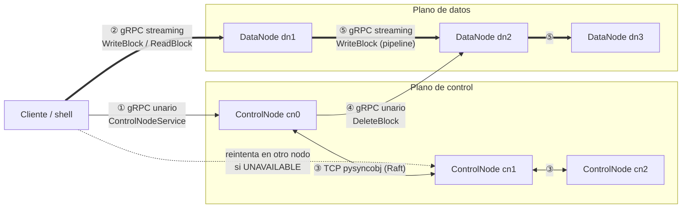
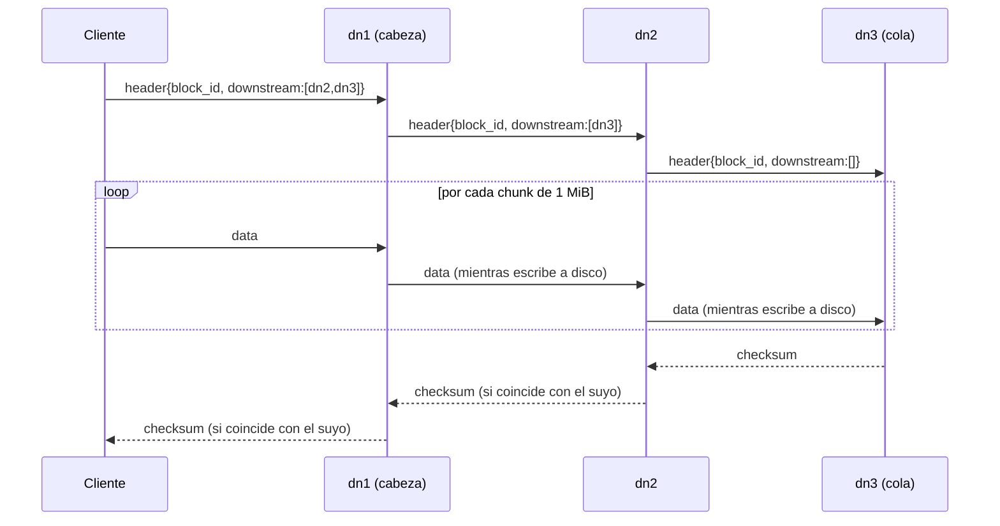
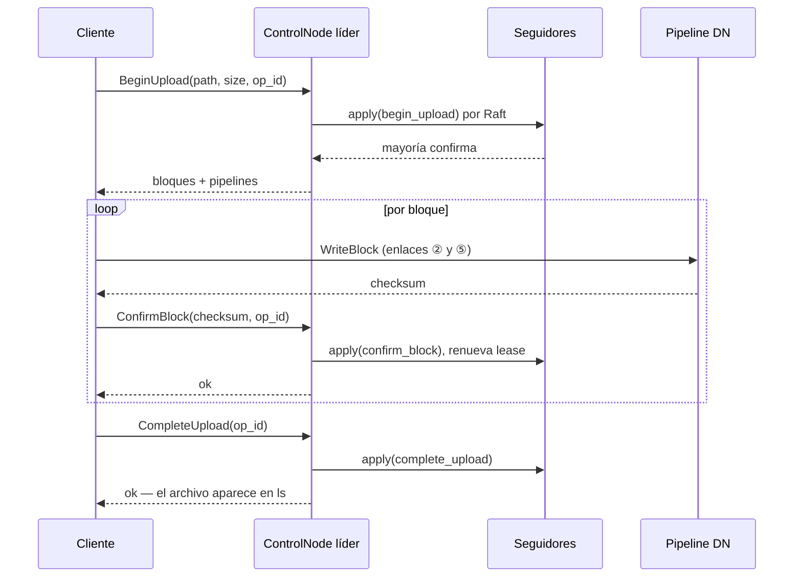
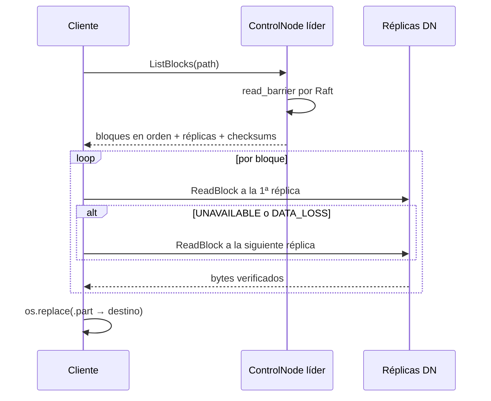

# DFSha — Especificación de comunicaciones (Hito 2)

> **Estado:** BORRADOR para revisión del equipo. Describe lo que está implementado en la rama `hito2-docker-y-fixes`.
> **Qué cubre:** los cinco enlaces que pide el enunciado — Cliente↔ControlNode, Cliente↔DataNode, ControlNode↔ControlNode, ControlNode↔DataNode, DataNode↔DataNode —, con protocolo, contrato, semántica de fallos y justificación de cada decisión.
> **Contratos fuente:** `proto/control_node.proto`, `proto/data_node.proto`. Consenso: `pysyncobj==0.3.17`.

---

## 1. Vista general



| # | Enlace | Protocolo | Estilo | Qué transporta | Puerto (Docker) |
|:---:|---|---|---|---|---|
| ① | Cliente → ControlNode | gRPC sobre HTTP/2 | Unario, petición-respuesta | Metadatos (KB) | `50051` |
| ② | Cliente → DataNode | gRPC sobre HTTP/2 | *Client streaming* (escritura), *server streaming* (lectura) | Bloques (MB) | `50061` |
| ③ | ControlNode ↔ ControlNode | TCP propio de `pysyncobj` | Mensajes asíncronos de Raft | Log replicado, votos, heartbeats | `6000` |
| ④ | ControlNode → DataNode | gRPC sobre HTTP/2 | Unario, *best-effort* | Órdenes de borrado | `50061` |
| ⑤ | DataNode → DataNode | gRPC sobre HTTP/2 | *Client streaming* encadenado | Réplicas de bloques | `50061` |

**Principio que gobierna el diseño: separación de planos.** Por el ControlNode solo pasan metadatos; los bytes de los archivos van siempre directo entre cliente y DataNodes, o entre DataNodes. La carga del ControlNode crece con el número de operaciones, no con el volumen de datos.

---

## 2. Por qué gRPC

Se evaluaron REST/HTTP, gRPC, sockets TCP y un MOM (RabbitMQ/Kafka).

| Criterio | REST | **gRPC** | Sockets TCP | MOM |
|---|---|---|---|---|
| Transferir bloques de 128 MB sin cargarlos en RAM | Requiere *chunked encoding* o multipart a mano | **Streaming nativo en ambos sentidos, con control de flujo de HTTP/2** | Hay que inventar el *framing* | Los brokers no están pensados para mensajes de 128 MB |
| Contrato explícito y versionable | OpenAPI, opcional | **`.proto` obligatorio, código generado** | Ninguno | Esquema libre |
| Códigos de error semánticos | Códigos HTTP | **`StatusCode` (`NOT_FOUND`, `UNAVAILABLE`, `DATA_LOSS`…)** | A mano | A mano |
| Deadlines por llamada | Por cliente HTTP | **Nativos** | A mano | No aplica |
| Un solo stack para los 4 enlaces que no son Raft | No (streaming incómodo) | **Sí** | Sí, con mucho código | No |

**Decisión:** gRPC en los enlaces ①, ②, ④ y ⑤. Para ① bastaría REST, pero usar el mismo stack en todo el sistema evita dos modelos de errores y dos formas de generar clientes. El enlace ③ no se diseñó: lo impone la librería de consenso (§5).

---

## 3. Enlace ① — Cliente → ControlNode

**Servicio:** `dfsha.control_node.ControlNodeService` (9 RPC, todos unarios).

| RPC | Muta | Descripción |
|---|:---:|---|
| `ListDir(path)` | — | Hijos de un directorio. Solo archivos `committed`. |
| `MakeDir(path, op_id)` | ✓ | El padre debe existir. |
| `RemoveDir(path, op_id)` | ✓ | Solo directorios vacíos. |
| `Remove(path, op_id)` | ✓ | Borra el archivo; dispara ④ para sus bloques. |
| `BeginUpload(path, size_bytes, op_id)` | ✓ | Reserva `⌈size / block_size⌉` bloques y elige su pipeline. El archivo queda `pending` con un lease. |
| `ConfirmBlock(path, block_id, checksum, size_bytes, op_id)` | ✓ | Marca un bloque escrito y renueva el lease. |
| `CompleteUpload(path, op_id)` | ✓ | `pending → committed` si todos los bloques están confirmados. |
| `AbortUpload(path, op_id)` | ✓ | Descarta una subida pendiente. |
| `ListBlocks(path)` | — | Bloques en orden, con réplicas en orden de pipeline y checksum. |

**Descubrimiento del líder.** El cliente recibe la lista de los 3 ControlNodes. Solo el líder atiende; los seguidores responden `UNAVAILABLE`. El cliente empieza por el último líder conocido y rota ante `UNAVAILABLE` o `DEADLINE_EXCEEDED`.

| Parámetro | Valor | Dónde |
|---|---|---|
| Timeout por intento | 5 s | `DEFAULT_RPC_TIMEOUT_S` (cliente) |
| Presupuesto total de reintentos | 15 s | `DEFAULT_FAILOVER_BUDGET_S` (cliente) |
| Espera entre vueltas | 0,2 s | `_RETRY_BACKOFF_S` (cliente) |
| Espera del líder por la mayoría | 3 s | `DEFAULT_COMMIT_TIMEOUT_S` (servidor, < timeout del cliente) |
| Lease de subida pendiente | 600 s | `--upload-lease-s` (servidor) |

**Semántica de las escrituras.** Cada mutación se replica por Raft y se responde **después** de que la mayoría la confirma. Si el commit no se confirma a tiempo, el resultado es **desconocido** y el servidor responde `UNAVAILABLE`.

**Idempotencia.** Toda mutación lleva `op_id`, generado por el cliente una sola vez por operación lógica y reutilizado en cada reintento. El ControlNode deduplica por `op_id` dentro del estado replicado (últimas 10.000 operaciones), así que un nuevo líder también reconoce lo ya aplicado. Un `op_id` vacío se rechaza con `INVALID_ARGUMENT`.

**Semántica de las lecturas.** Linealizables: antes de leer, el líder confirma por Raft una entrada vacía (`read_barrier`). Un líder aislado de la mayoría no puede confirmarla y responde `UNAVAILABLE` en vez de servir datos viejos.

**Errores.**

| `StatusCode` | Excepción de dominio | Cuándo |
|---|---|---|
| `NOT_FOUND` | `PathNotFoundError` | Ruta inexistente, o subida pendiente que no existe |
| `ALREADY_EXISTS` | `PathExistsError` | Nombre ocupado (incluida una subida pendiente con lease vivo) |
| `FAILED_PRECONDITION` | `NotEmptyError` | `rmdir` de un directorio con contenido |
| `PERMISSION_DENIED` | `InvalidPathError` | Ruta con `..`, borrar la raíz, tamaño ≤ 0 |
| `INVALID_ARGUMENT` | `NotAFileError`, `NotADirectoryError` | Tipo de nodo equivocado; `op_id` vacío |
| `UNAVAILABLE` | — (el cliente reintenta) | Nodo seguidor, nodo caído, commit o barrera sin confirmar |

---

## 4. Enlace ② — Cliente → DataNode

**Servicio:** `dfsha.data_node.DataNodeService`.

### Escritura: `WriteBlock(stream WriteBlockChunk) → WriteBlockResponse`

```
mensaje 1:  WriteBlockChunk{ header: { block_id, downstream: [dn2:50061, dn3:50061] } }
mensaje 2…: WriteBlockChunk{ data: <≤ 1 MiB> }
respuesta:  { checksum: <SHA-256 hex>, bytes_written }
```

- El cliente escribe **solo a la cabeza** del pipeline (`datanode_addresses[0]` de `BeginUpload`); `downstream` es el resto de la lista. La replicación es responsabilidad del clúster (enlace ⑤).
- El primer mensaje **debe** ser el header; si no, `INVALID_ARGUMENT`.
- `block_id` debe ser exactamente 32 hexadecimales en minúscula (se valida antes de tocar el disco).
- La respuesta llega cuando **las 3 réplicas** terminaron (quórum 3 de 3). El checksum devuelto es el que el cliente reporta en `ConfirmBlock`.

### Lectura: `ReadBlock(block_id) → stream ReadBlockChunk`

- El DataNode recalcula el SHA-256 del bloque **antes** de enviar el primer byte. Si no coincide con el guardado: `DATA_LOSS`, sin enviar datos.
- Trozos de 1 MiB.
- **Failover en el cliente:** prueba las réplicas en orden; ante `UNAVAILABLE` o `DATA_LOSS` descarta los bytes parciales de ese bloque (`seek` + `truncate`) y pasa a la siguiente. Solo falla si fallan todas.

| `StatusCode` | Significado |
|---|---|
| `NOT_FOUND` | El DataNode no tiene ese bloque, o el `block_id` es inválido |
| `DATA_LOSS` | Checksum no coincide (lectura), o réplicas con checksum distinto (escritura) |
| `UNAVAILABLE` | DataNode caído, o falló una réplica aguas abajo del pipeline |

**Limitación conocida:** estas llamadas no tienen deadline en el cliente; un DataNode colgado (no caído) bloquearía la operación.

---

## 5. Enlace ③ — ControlNode ↔ ControlNode

**Protocolo:** el transporte TCP propio de `pysyncobj`, que implementa Raft. No es gRPC y no se puede sustituir sin cambiar de librería.

| Aspecto | Valor |
|---|---|
| Formato en el cable | Mensajes Python serializados con `pickle` y comprimidos con `zlib` |
| Topología | Malla completa entre los 3 nodos; `--raft-cluster` idéntico y en el mismo orden en todos |
| Qué viaja | `AppendEntries` (log replicado y heartbeats), `RequestVote`, snapshots |
| Elección de líder | Por mayoría (2 de 3). Timeout aleatorio entre 0,4 y 1,4 s |
| Heartbeat del líder | Cada 0,1 s |
| Conexión considerada muerta | Tras 3,5 s sin datos |
| Reintento de conexión | Cada 5 s |
| Persistencia | `raft.journal` (log) y `raft.dump` (snapshot) en `--data-dir`; compactación cada 5.000 entradas, sin `fork()` |
| Comando replicado | Uno genérico, `apply(op_id, method, args)`, con lista blanca de 7 mutaciones; nunca lanza excepciones ni tiene efectos secundarios |

**Direccionamiento.** `pysyncobj` escucha en la misma dirección que anuncia a los demás, así que la dirección de Raft debe ser resoluble por los otros nodos: nombres de servicio en Docker (`cn0:6000`), IPs o DNS privados en despliegue real. `localhost` solo sirve con los 3 nodos en la misma máquina.

> ⚠️ **Seguridad:** este enlace no está cifrado ni autenticado, y deserializar `pickle` de la red permite ejecutar código arbitrario. **El puerto de Raft nunca debe exponerse fuera de la red privada.** En Docker Compose no se publica. Para el Hito 3, `pysyncobj` permite cifrado y autenticación del canal configurando `password` (usa Fernet con clave derivada por PBKDF2; requiere el paquete `cryptography`).

---

## 6. Enlace ④ — ControlNode → DataNode

**RPC:** `DeleteBlock(block_id) → DeleteBlockResponse`, unario.

| Cuándo se envía | Semántica |
|---|---|
| Tras confirmar un `Remove` | *Best-effort*: la metadata ya se borró; un fallo no revierte la operación ni se reporta al cliente |
| Tras un `BeginUpload` que reemplazó una subida pendiente con lease vencido | Ídem, para los bloques de la subida abandonada |

Se envía **solo desde el líder y después del commit**, nunca dentro de la máquina de estados: `apply()` se ejecuta en los 3 nodos y se reproduce en cada reinicio.

**Lo que este enlace todavía no tiene** (Hito 3): *heartbeats* y *block reports* del DataNode al ControlNode. Sin ellos, el ControlNode no detecta DataNodes caídos, no re-replica y no limpia bloques huérfanos; la lista de DataNodes es estática (`--datanode-addresses`).

---

## 7. Enlace ⑤ — DataNode → DataNode (pipeline de replicación)

**RPC:** el mismo `WriteBlock` del enlace ②. Un DataNode que reenvía es, para el siguiente, un cliente más.



| Aspecto | Comportamiento |
|---|---|
| Orden del pipeline | Round-robin en el ControlNode: cada bloque empieza un DataNode más adelante |
| Escritura y reenvío | Simultáneos: cada chunk va a disco y a una cola hacia el siguiente |
| Memoria | Cola acotada a 4 chunks (4 MiB): si el siguiente va lento, el anterior se bloquea (*backpressure*) |
| Hilos | Pool propio de 10 para reenviar, separado del del servidor gRPC, para que el pipeline no se bloquee a sí mismo |
| Quórum | 3 de 3. Si falla un eslabón, cada nodo anterior borra su copia y responde `UNAVAILABLE`; el cliente aborta la subida |
| Integridad | Cada eslabón compara su SHA-256 con el del siguiente; si difieren, `DATA_LOSS` |
| Factor | `--replication-factor` (3). Con menos DataNodes que el factor, se replica en todos los disponibles |

**Consecuencia a tener presente:** con exactamente 3 DataNodes y factor 3, un solo DataNode caído hace fallar **todas** las escrituras (las lecturas siguen funcionando). Es el costo de la escritura síncrona 3 de 3 con lista estática; se resuelve con detección de fallos por heartbeats (Hito 3).

---

## 8. Flujos completos

### Subida (`send`)



### Bajada (`receive`)



---

## 9. Despliegue de red

| Entorno | Resolución de nombres | Qué se publica |
|---|---|---|
| **Docker Compose** | Red bridge `dfsha`: `cn0..cn2`, `dn1..dn3` | Nada. El cliente corre dentro de la red (`docker compose run shell`) |
| **Procesos locales** | `localhost` con puertos distintos por nodo | — |
| **AWS (Hito 3)** | IPs o DNS privados de la VPC | Solo lo que usen los clientes; nunca el puerto de Raft |

**Dirección anunciada.** El ControlNode entrega al cliente las direcciones de los DataNodes **tal como están configuradas** en `--datanode-addresses`. Deben ser resolubles y alcanzables **desde el cliente**. Es la razón por la que, en Docker, la shell corre dentro de la red: `dn1:50061` no resuelve desde el host.

---

## 10. Seguridad (estado actual y plan para Hito 3)

| Enlace | Hoy | Hito 3 |
|---|---|---|
| ① Cliente ↔ ControlNode | `insecure_channel`, sin autenticación | TLS + autenticación de usuario (token) + ACL por ruta |
| ② Cliente ↔ DataNode | `insecure_channel` | TLS + token de acceso al bloque emitido por el ControlNode |
| ③ ControlNode ↔ ControlNode | Sin cifrar, `pickle` en el cable | `password` de `pysyncobj` (Fernet) y puerto solo en red privada |
| ④ ControlNode → DataNode | `insecure_channel` | mTLS |
| ⑤ DataNode ↔ DataNode | `insecure_channel` | mTLS |

Ya implementado a favor de la seguridad: validación de rutas (`..` rechazado), validación del formato de `block_id` antes de construir rutas en disco, y verificación de integridad SHA-256 en cada lectura.
