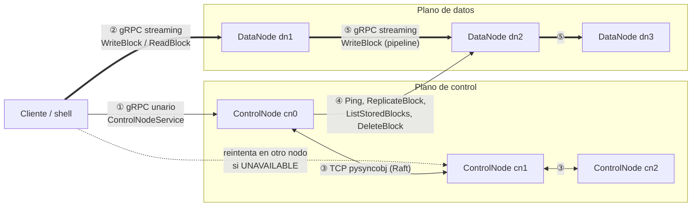
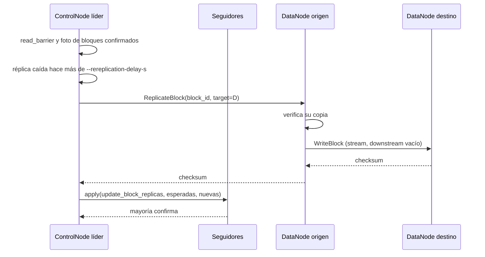
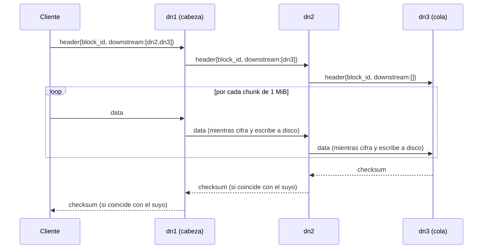
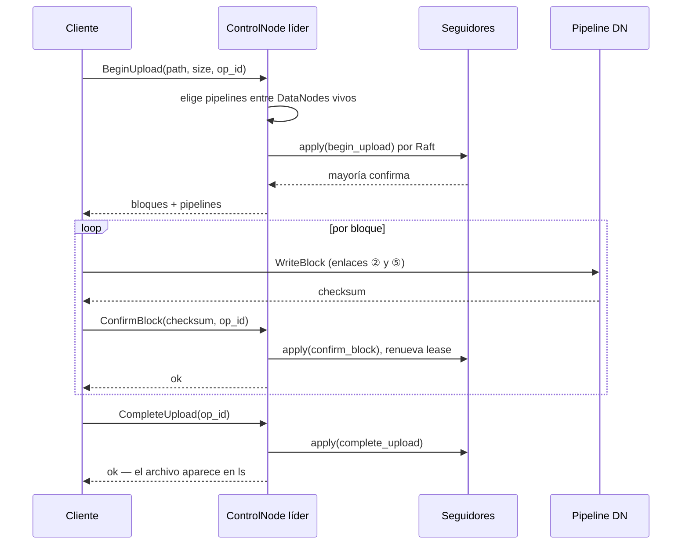
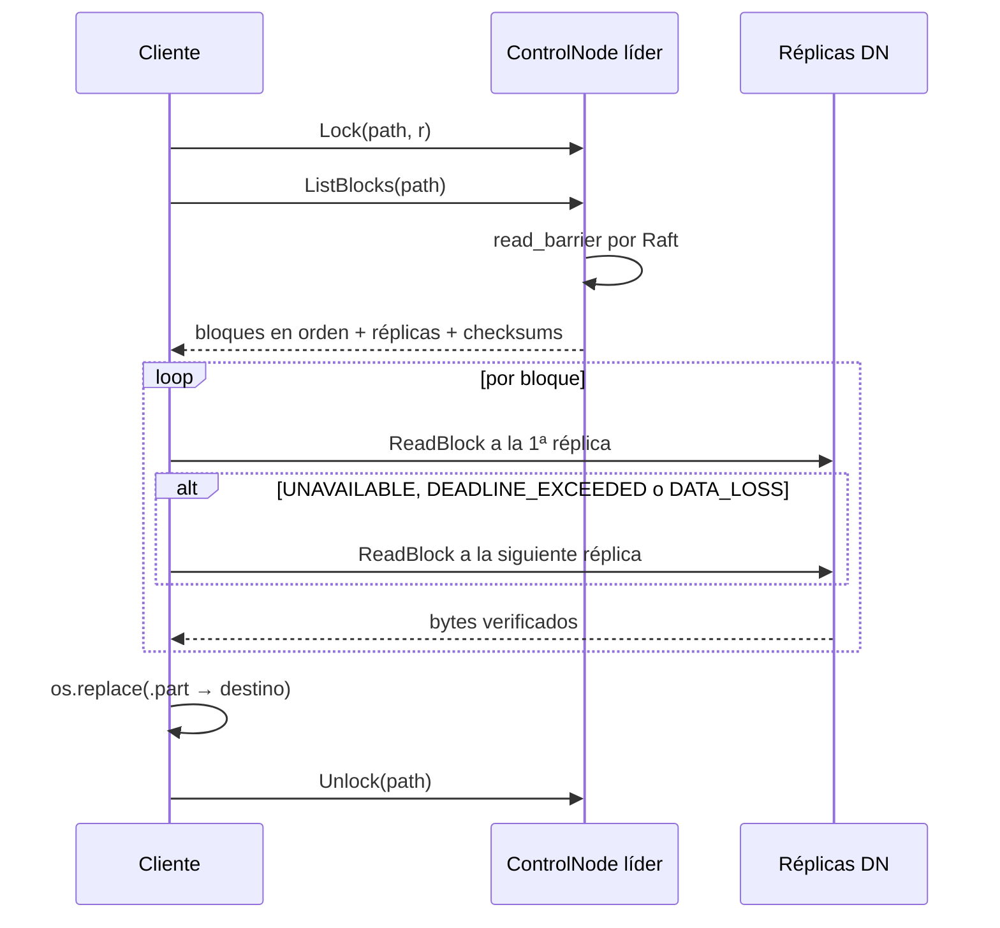
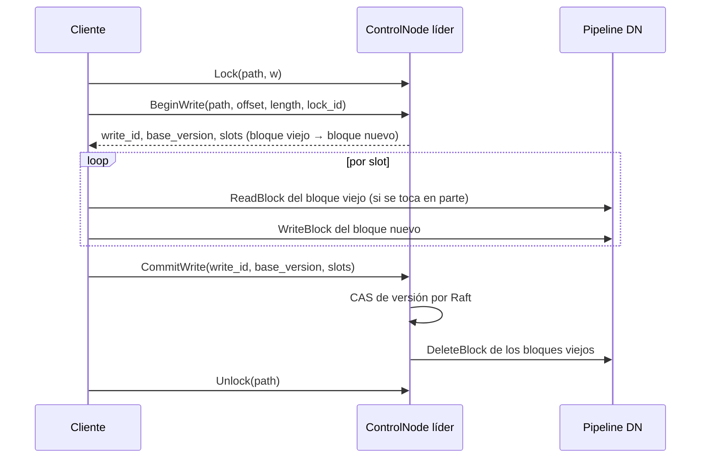

# DFSha — Especificación de comunicaciones

> **Estado:** describe lo implementado en `main` en el Hito 3: alta disponibilidad, consistencia, cifrado en reposo, TLS, canal Raft cifrado, transferencia paralela, y usuarios con login y token de sesión (C2). Los permisos por archivo y la autorización en los DataNodes (C3) todavía no están: §10 dice qué cambia cuando entren.
> **Qué cubre:** los cinco enlaces que pide el enunciado — Cliente↔ControlNode, Cliente↔DataNode, ControlNode↔ControlNode, ControlNode↔DataNode, DataNode↔DataNode —, con protocolo, contrato, semántica de fallos y justificación de cada decisión.
> **Contratos fuente:** `proto/control_node.proto`, `proto/data_node.proto`. Consenso: `pysyncobj==0.3.17`.

---

## 1. Vista general


```mermaid
flowchart LR
    C[Cliente / shell]
    subgraph Control["Plano de control"]
        CN0[ControlNode cn0]
        CN1[ControlNode cn1]
        CN2[ControlNode cn2]
    end
    subgraph Datos["Plano de datos"]
        DN1[DataNode dn1]
        DN2[DataNode dn2]
        DN3[DataNode dn3]
    end
    C -- "① gRPC unario<br/>ControlNodeService" --> CN0
    C -. "reintenta en otro nodo<br/>si UNAVAILABLE" .-> CN1
    C == "② gRPC streaming<br/>WriteBlock / ReadBlock" ==> DN1
    CN0 <-- "③ TCP pysyncobj (Raft)" --> CN1
    CN1 <-- "③" --> CN2
    CN0 -- "④ Ping, ReplicateBlock,<br/>ListStoredBlocks, DeleteBlock" --> DN2
    DN1 == "⑤ gRPC streaming<br/>WriteBlock (pipeline)" ==> DN2
    DN2 == "⑤" ==> DN3
```

| # | Enlace | Protocolo | Estilo | Qué transporta | Puerto (Docker) |
|:---:|---|---|---|---|---|
| ① | Cliente → ControlNode | gRPC sobre HTTP/2 + TLS | Unario, petición-respuesta | Metadatos, locks, reservas de escritura (KB) | `50051` |
| ② | Cliente → DataNode | gRPC sobre HTTP/2 + TLS | *Client streaming* (escritura), *server streaming* (lectura) | Bloques o rangos de bloque (MB) | `50061` |
| ③ | ControlNode ↔ ControlNode | TCP propio de `pysyncobj`, cifrado con password | Mensajes asíncronos de Raft | Log replicado, votos, heartbeats | `6000` |
| ④ | ControlNode → DataNode | gRPC sobre HTTP/2 + TLS | Unario y *server streaming* | Liveness, órdenes de copia y de borrado, inventario | `50061` |
| ⑤ | DataNode → DataNode | gRPC sobre HTTP/2 + TLS | *Client streaming* encadenado | Réplicas de bloques (pipeline y re-replicación) | `50061` |

**Principio que gobierna el diseño: separación de planos.** Por el ControlNode solo pasan metadatos; los bytes de los archivos van siempre directo entre cliente y DataNodes, o entre DataNodes. La carga del ControlNode crece con el número de operaciones, no con el volumen de datos. Esto se mantiene también en la re-replicación: el ControlNode ordena la copia, pero los bytes van de un DataNode a otro.

---

## 2. Por qué gRPC

Se evaluaron REST/HTTP, gRPC, sockets TCP y un MOM (RabbitMQ/Kafka).

| Criterio | REST | **gRPC** | Sockets TCP | MOM |
|---|---|---|---|---|
| Transferir bloques de 128 MB sin cargarlos en RAM | Requiere *chunked encoding* o multipart a mano | **Streaming nativo en ambos sentidos, con control de flujo de HTTP/2** | Hay que inventar el *framing* | Los brokers no están pensados para mensajes de 128 MB |
| Contrato explícito y versionable | OpenAPI, opcional | **`.proto` obligatorio, código generado** | Ninguno | Esquema libre |
| Códigos de error semánticos | Códigos HTTP | **`StatusCode` (`NOT_FOUND`, `UNAVAILABLE`, `DATA_LOSS`…)** | A mano | A mano |
| Deadlines por llamada | Por cliente HTTP | **Nativos** | A mano | No aplica |
| Un solo stack para los 4 enlaces que no son Raft | No (streaming incómodo) | **Sí** | Sí, con mucho código | No |

**Decisión:** gRPC en los enlaces ①, ②, ④ y ⑤. Para ① bastaría REST, pero usar el mismo stack en todo el sistema evita dos modelos de errores y dos formas de generar clientes. El enlace ③ no se diseñó: lo impone la librería de consenso (§5).

---

## 3. Enlace ① — Cliente → ControlNode

**Servicio:** `dfsha.control_node.ControlNodeService` (18 RPC, todos unarios). Con la autenticación activa, todos salvo `Login` exigen el token de sesión en la metadata de la llamada: `authorization: Bearer <jwt>` (§10).

| RPC | Muta | Descripción |
|---|:---:|---|
| `ListDir(path)` | — | Hijos de un directorio. Solo archivos `committed`. |
| `MakeDir(path, op_id)` | ✓ | El padre debe existir. |
| `RemoveDir(path, op_id)` | ✓ | Solo directorios vacíos. |
| `Remove(path, op_id)` | ✓ | Borra el archivo si nadie tiene un lock vigente; dispara `DeleteBlock` (④) para sus bloques. |
| `BeginUpload(path, size_bytes, op_id)` | ✓ | Reserva `⌈size / block_size⌉` bloques y elige el pipeline de cada uno entre los DataNodes vivos. El archivo queda `pending` con un lease. |
| `ConfirmBlock(path, block_id, checksum, size_bytes, op_id)` | ✓ | Marca un bloque escrito y renueva el lease. |
| `CompleteUpload(path, op_id)` | ✓ | `pending → committed` si todos los bloques están confirmados. |
| `AbortUpload(path, op_id)` | ✓ | Descarta una subida pendiente y borra al instante los bloques ya escritos. |
| `ListBlocks(path)` | — | Bloques en orden, con réplicas en orden de pipeline, tamaño y checksum. |
| `Lock(path, mode, op_id)` | ✓ | Toma un lock compartido (`r`) o exclusivo (`w`) con lease. Devuelve `lock_id` y `lease_s`. |
| `RenewLock(path, lock_id, op_id)` | ✓ | Renueva el lease de un lock propio. |
| `Unlock(path, lock_id, op_id)` | ✓ | Libera un lock propio. |
| `BeginWrite(path, offset, length, lock_id, op_id)` | ✓ | Reserva bloques nuevos para los bloques que toca una escritura (copy-on-write). |
| `CommitWrite(path, write_id, base_version, lock_id, slots, op_id)` | ✓ | Publica los bloques nuevos si la versión del archivo no cambió. |
| `AbortWrite(path, write_id, lock_id, op_id)` | ✓ | Descarta la reserva y borra los bloques nuevos. |
| `Login(username, password)` | — | Devuelve el token de sesión y su duración. Es el único RPC que no exige token. |
| `CreateUser(username, password, groups, is_admin, op_id)` | ✓ | Solo un admin. Sin grupos, el usuario queda en un grupo con su nombre. |
| `ChangePassword(username, current_password, new_password, op_id)` | ✓ | La propia exige la contraseña actual; un admin cambia la de otro sin ella. |

**Descubrimiento del líder.** El cliente recibe la lista de los 3 ControlNodes. Solo el líder atiende; los seguidores responden `UNAVAILABLE`. El cliente empieza por el último líder conocido y rota ante `UNAVAILABLE` o `DEADLINE_EXCEEDED`.

| Parámetro | Valor | Dónde |
|---|---|---|
| Timeout por intento | 5 s | `DEFAULT_RPC_TIMEOUT_S` (cliente) |
| Presupuesto total de reintentos | 15 s | `DEFAULT_FAILOVER_BUDGET_S` (cliente) |
| Espera entre vueltas | 0,2 s | `_RETRY_BACKOFF_S` (cliente) |
| Espera del líder por la mayoría | 3 s | `DEFAULT_COMMIT_TIMEOUT_S` (servidor, < timeout del cliente) |
| Lease de subida pendiente y de reserva de escritura | 600 s | `--upload-lease-s` (servidor) |
| Lease de lock | 30 s; el cliente renueva cada tercio | `--lock-lease-s` (servidor) |

**Semántica de las escrituras.** Cada mutación se replica por Raft y se responde **después** de que la mayoría la confirma. Si el commit no se confirma a tiempo, el resultado es **desconocido** y el servidor responde `UNAVAILABLE`.

**Idempotencia.** Toda mutación lleva `op_id`, generado por el cliente una sola vez por operación lógica y reutilizado en cada reintento. El ControlNode deduplica por `op_id` dentro del estado replicado (últimas 10.000 operaciones), así que un nuevo líder también reconoce lo ya aplicado y devuelve el resultado original. Un `op_id` vacío se rechaza con `INVALID_ARGUMENT`.

**Semántica de las lecturas.** Linealizables: antes de leer, el líder confirma por Raft una entrada vacía (`read_barrier`). Un líder aislado de la mayoría no puede confirmarla y responde `UNAVAILABLE` en vez de servir datos viejos.

**Determinismo.** Todo lo que no es determinista lo decide el líder **antes** del commit y viaja en los argumentos del comando replicado: la hora (`now`) para leases, los `block_id` nuevos y las réplicas vivas. La máquina de estados solo valida y aplica.

### Locks (RF3)

- Varios lectores (`r`) o un escritor (`w`) por archivo. Las rutas se canonizan: `/docs/a.txt`, `docs/a.txt` y `/docs//a.txt` compiten por el mismo lock.
- Un lock vence si no se renueva en `lease_s`; los vencidos se limpian en la siguiente mutación. Así, un cliente que muere no deja un archivo bloqueado para siempre.
- `receive`, `cat` y `read` toman un lock compartido mientras leen; `write` toma el exclusivo si el cliente no tiene ya un handle abierto con `open`.
- `Remove` sobre un archivo con un lock vigente y `Lock` en conflicto responden `ABORTED` (`ConflictError`).

### Escritura por rangos (copy-on-write)

Los bloques son inmutables. `write` reserva bloques nuevos, el cliente los escribe por el pipeline normal (② y ⑤) y el commit los publica juntos. Hasta el commit, quien lea ve el archivo anterior.

| RPC | Qué hace | Errores |
|---|---|---|
| `BeginWrite` | Pasa la barrera de lectura, arma la propuesta (IDs y réplicas vivas) y la reserva por Raft; la máquina de estados la vuelve a validar. Devuelve `write_id`, `base_version`, `block_size` y un `WriteSlot` por bloque tocado (bloque viejo y bloque nuevo) | `ABORTED` sin lock exclusivo vigente o si el archivo cambió; `PERMISSION_DENIED` (`InvalidPathError`) si `offset` > tamaño o `length` ≤ 0 |
| `CommitWrite` | Compare-and-set de `FileNode.version`: si sigue siendo `base_version`, la reserva sigue vigente y el lock sigue siendo del writer, publica y suma 1 a la versión. Después del commit, el líder borra los bloques viejos | `ABORTED` si algo de lo anterior no se cumple; no publica nada |
| `AbortWrite` | Descarta la reserva y borra los bloques nuevos. Abortar una reserva que ya no existe no es error | `ABORTED` si la reserva es de otro lock |

Cuando la escritura toca un bloque solo en parte, el cliente primero lee el bloque viejo con `ReadBlock` para completarlo. Si `CommitWrite` queda con resultado incierto, el `AbortWrite` posterior es inofensivo: una reserva ya publicada no existe y no se borra nada.

### Errores

| `StatusCode` | Excepción de dominio | Cuándo |
|---|---|---|
| `NOT_FOUND` | `PathNotFoundError` | Ruta inexistente, o subida pendiente que no existe |
| `ALREADY_EXISTS` | `PathExistsError` | Nombre ocupado (incluida una subida pendiente con lease vivo) |
| `FAILED_PRECONDITION` | `NotEmptyError` | `rmdir` de un directorio con contenido |
| `PERMISSION_DENIED` | `InvalidPathError` | Ruta con `..`, borrar la raíz, tamaño ≤ 0, rango de escritura inválido |
| `INVALID_ARGUMENT` | `NotAFileError`, `NotADirectoryError` | Tipo de nodo equivocado; `op_id` vacío |
| `ABORTED` | `ConflictError` | Lock en conflicto, archivo con locks al borrarlo, escritura sobre una versión vieja |
| `UNAUTHENTICATED` | `AuthError` | Falta el token, está vencido o es inválido; usuario o contraseña incorrectos en `Login`. El cliente no reintenta en otro nodo |
| `PERMISSION_DENIED` | `AccessDeniedError` | El usuario no es admin, o la contraseña actual no coincide en `ChangePassword`. Se distingue de `InvalidPathError` por el trailer `dfsha-error` |
| `UNIMPLEMENTED` | — | `Login`, `CreateUser` o `ChangePassword` contra un clúster que arrancó sin autenticación |
| `UNAVAILABLE` | — (el cliente reintenta) | Nodo seguidor, nodo caído, commit o barrera sin confirmar, menos DataNodes vivos que `--min-write-replicas` |

---

## 4. Enlace ② — Cliente → DataNode

**Servicio:** `dfsha.data_node.DataNodeService`.

### Escritura: `WriteBlock(stream WriteBlockChunk) → WriteBlockResponse`

```
mensaje 1:  WriteBlockChunk{ header: { block_id, downstream: [dn2:50061, dn3:50061] } }
mensaje 2…: WriteBlockChunk{ data: <≤ 1 MiB> }
respuesta:  { checksum: <SHA-256 hex del texto plano>, bytes_written }
```

- El cliente escribe **solo a la cabeza** del pipeline (`datanode_addresses[0]` de `BeginUpload` o del `WriteSlot`); `downstream` es el resto de la lista. La replicación es responsabilidad del clúster (enlace ⑤).
- El primer mensaje **debe** ser el header; si no, `INVALID_ARGUMENT`.
- `block_id` debe ser exactamente 32 hexadecimales en minúscula (se valida antes de tocar el disco y antes de reenviar).
- La respuesta llega cuando **todas las réplicas del pipeline** terminaron: 3, o 2 si el ControlNode armó el pipeline con un DataNode caído. El checksum devuelto es el que el cliente reporta en `ConfirmBlock`.

### Lectura: `ReadBlock(block_id, offset, length) → stream ReadBlockChunk`

- `offset` y `length` piden un rango dentro del bloque; `length` 0 significa hasta el final, así que un cliente que no los manda lee el bloque completo. Un rango negativo: `INVALID_ARGUMENT`.
- El cliente traduce un rango del archivo (`cat`, `read`) a rangos de bloque sumando los tamaños que devuelve `ListBlocks`, y pide a cada DataNode solo su parte.
- **Failover:** prueba las réplicas en orden; ante `UNAVAILABLE`, `DEADLINE_EXCEEDED`, `DATA_LOSS` o un `NOT_FOUND` marcado como `BlockNotFoundError`, descarta los bytes parciales de ese bloque (`seek` + `truncate`) y pasa a la siguiente. Solo falla si fallan todas.

### Almacenamiento cifrado

Cada DataNode guarda un único contenedor `DFSE1` por `block_id`:

| Parte | Contenido |
|---|---|
| Header | Magic `DFSE1`, versión y prefijo aleatorio de nonce (8 bytes) |
| Chunks | Hasta 1 MiB de texto plano cada uno, cifrado con AES-256-GCM. Nonce = prefijo + contador de 4 bytes; AAD = `block_id`, índice y marca de último |
| Metadata final | Tamaño lógico, número de chunks y SHA-256 del texto plano, también autenticada (contador 2³²−1) |

`ReadBlock` autentica primero la metadata y después solo los chunks del rango pedido. Magic ausente, un archivo en texto plano, truncación o un tag inválido producen `DATA_LOSS`. La llave es de 32 bytes, distinta por DataNode, y se pasa con `--encryption-key-file`.

| `StatusCode` | Significado |
|---|---|
| `NOT_FOUND` | El DataNode no tiene ese bloque, o el `block_id` es inválido |
| `DATA_LOSS` | Bloque corrupto, truncado o cifrado con otra llave (lectura); réplicas con checksum distinto (escritura) |
| `UNAVAILABLE` | DataNode caído, o falló una réplica aguas abajo del pipeline |
| `INVALID_ARGUMENT` | Stream sin header, rango negativo |

**Paralelismo.** `send` y `receive` transfieren hasta `--parallel-transfers` bloques a la vez (4 por defecto), cada uno en su propio stream. En la subida, el orden de los `ConfirmBlock` no importa: el archivo se publica con `CompleteUpload` cuando están todos. En la bajada, cada bloque se escribe en su posición del archivo `.part`. Al primer error, los bloques pendientes no arrancan, los que están en vuelo se cancelan y se aborta la operación con todos los hilos quietos. `read`, `cat` y `write` siguen en serie.

**Deadlines.** Cada `ReadBlock` y `WriteBlock` lleva un deadline calculado por los bytes que mueve: 5 s más el tamaño a 1 MiB/s. Un DataNode colgado no bloquea la operación y una transferencia lenta pero activa no se corta.

---

## 5. Enlace ③ — ControlNode ↔ ControlNode

**Protocolo:** el transporte TCP propio de `pysyncobj`, que implementa Raft. No es gRPC y no se puede sustituir sin cambiar de librería.

| Aspecto | Valor |
|---|---|
| Formato en el cable | Mensajes Python serializados con `pickle` y comprimidos con `zlib` |
| Topología | Malla completa entre los 3 nodos; `--raft-cluster` idéntico y en el mismo orden en todos |
| Qué viaja | `AppendEntries` (log replicado y heartbeats), `RequestVote`, snapshots |
| Elección de líder | Por mayoría (2 de 3). Timeout aleatorio entre 0,4 y 1,4 s |
| Heartbeat del líder | Cada 0,1 s |
| Conexión considerada muerta | Tras 3,5 s sin datos |
| Reintento de conexión | Cada 5 s |
| Persistencia | `raft.journal` (log) y `raft.dump` (snapshot) en `--data-dir`; compactación cada 5.000 entradas, sin `fork()` |
| Comando replicado | Uno genérico, `apply(op_id, method, args)`, con lista blanca de 16 mutaciones; nunca lanza excepciones ni tiene efectos secundarios |

**Qué se replica y qué no.** Se replican el árbol, los bloques de cada archivo con sus réplicas, las subidas pendientes, los locks, las reservas de escritura y los `op_id` aplicados. **No** se replica qué DataNodes están vivos: cada ControlNode lo mide por su cuenta (§6), porque es una observación local y cambia cada segundo.

**Direccionamiento.** `pysyncobj` escucha en la misma dirección que anuncia a los demás, así que la dirección de Raft debe ser resoluble por los otros nodos: nombres de servicio en Docker (`cn0:6000`), IPs o DNS privados en despliegue real. `localhost` solo sirve con los 3 nodos en la misma máquina.

> **Seguridad:** el canal va cifrado y autenticado con la `password` de `pysyncobj` (Fernet, clave derivada por PBKDF2), leída de `--raft-password-file` (`secrets/raft.password`). Un nodo sin la password no puede leer el log ni votar. Igual **el puerto de Raft nunca debe exponerse fuera de la red privada**: los mensajes son `pickle`, y deserializar `pickle` de quien tenga la password permite ejecutar código. En Docker Compose no se publica.

---

## 6. Enlace ④ — ControlNode → DataNode

Cuatro RPC de `DataNodeService` que solo usa el ControlNode.

| RPC | Estilo | Quién y cuándo | Semántica |
|---|---|---|---|
| `Ping()` | Unario | Cada ControlNode, cada `--heartbeat-interval-s` (2 s), deadline de 1 s | Un DataNode sin respuesta durante `--datanode-dead-after-s` (6 s) sale de los pipelines de **ese** ControlNode. Vuelve en cuanto responde |
| `ReplicateBlock(block_id, target)` | Unario | El líder, cuando un bloque tiene menos copias que el factor | El DataNode origen verifica su copia y la envía completa a `target` con `WriteBlock` (enlace ⑤). Responde con el checksum |
| `ListStoredBlocks()` | *Server streaming* | El líder, cada `--gc-interval-s` (60 s) | Inventario: `block_id`, tamaño y **edad** calculada con el reloj del DataNode |
| `DeleteBlock(block_id)` | Unario | El líder, después de un commit | *Best-effort*. `NOT_FOUND` cuenta como éxito |

Todos llevan deadline. Ninguno se envía desde dentro de la máquina de estados: `apply()` corre en los 3 nodos y se reproduce en cada reinicio.

### Detección de fallos (liveness)

Es *pull*: el ControlNode pregunta y el DataNode solo responde. Así un DataNode no necesita saber quién es el líder, y un ControlNode recién elegido ya tiene su propia vista. `BeginUpload` y `BeginWrite` arman cada pipeline con `min(factor, vivos)` DataNodes en round-robin; con menos de `--min-write-replicas` (2) vivos responden `UNAVAILABLE` antes de reservar nada.

### Re-replicación


```mermaid
sequenceDiagram
    participant L as ControlNode líder
    participant F as Seguidores
    participant O as DataNode origen
    participant D as DataNode destino
    L->>L: read_barrier y foto de bloques confirmados
    L->>L: réplica caída hace más de --rereplication-delay-s
    L->>O: ReplicateBlock(block_id, target=D)
    O->>O: verifica su copia
    O->>D: WriteBlock (stream, downstream vacío)
    D-->>O: checksum
    O-->>L: checksum
    L->>F: apply(update_block_replicas, esperadas, nuevas)
    F-->>L: mayoría confirma
```

- Solo corre en el líder, cada `--rereplication-interval-s` (10 s), con hasta `--rereplication-max-per-cycle` (4) copias por ciclo.
- Repara una réplica caída solo si lleva más de `--rereplication-delay-s` (30 s) muerta: un reinicio corto no dispara copias de bloques enteros. Un bloque escrito con 2 copias se completa en el siguiente ciclo.
- `update_block_replicas` es un compare-and-set: si las réplicas cambiaron mientras se copiaba, o el archivo se borró, no publica nada y la copia queda para el recolector.
- Un origen corrupto responde `DATA_LOSS`; el líder prueba el siguiente origen vivo.

### Recolector de huérfanos

Solo en el líder. Primero pide `ListStoredBlocks` a cada DataNode vivo y **después** pasa la barrera y toma la foto de la metadata: con ese orden, un bloque reservado entre las dos lecturas ya figura en la foto. Borra un bloque que ningún archivo, subida pendiente ni reserva de escritura usa, o una réplica que la metadata ya no asigna a ese nodo, si tiene más de `--gc-grace-s` (1200 s) de edad. La gracia cubre lo que un líder recién elegido no ve, como copias en vuelo del líder anterior.

---

## 7. Enlace ⑤ — DataNode → DataNode (pipeline de replicación)

**RPC:** el mismo `WriteBlock` del enlace ②. Un DataNode que reenvía es, para el siguiente, un cliente más. `ReplicateBlock` (§6) también usa este enlace, con `downstream` vacío.


```mermaid
sequenceDiagram
    participant C as Cliente
    participant A as dn1 (cabeza)
    participant B as dn2
    participant D as dn3 (cola)
    C->>A: header{block_id, downstream:[dn2,dn3]}
    A->>B: header{block_id, downstream:[dn3]}
    B->>D: header{block_id, downstream:[]}
    loop por cada chunk de 1 MiB
        C->>A: data
        A->>B: data (mientras cifra y escribe a disco)
        B->>D: data (mientras cifra y escribe a disco)
    end
    D-->>B: checksum
    B-->>A: checksum (si coincide con el suyo)
    A-->>C: checksum (si coincide con el suyo)
```

| Aspecto | Comportamiento |
|---|---|
| Orden del pipeline | Round-robin entre los DataNodes vivos: cada bloque empieza un DataNode más adelante |
| Escritura y reenvío | Simultáneos: cada chunk va a disco y a una cola hacia el siguiente |
| Memoria | Cola acotada a 4 chunks (4 MiB): si el siguiente va lento, el anterior se bloquea (*backpressure*) |
| Hilos | Pool propio de 10 para reenviar, separado del del servidor gRPC, para que el pipeline no se bloquee a sí mismo |
| Fallo de un eslabón | Cada nodo anterior borra su copia y responde `UNAVAILABLE`; el cliente aborta la subida. La protección contra un DataNode caído está antes: el ControlNode no lo incluye en el pipeline |
| Integridad | Cada eslabón compara su SHA-256 con el del siguiente; si difieren, `DATA_LOSS` |
| Cifrado | Cada DataNode cifra con su propia llave: el mismo bloque es distinto en cada disco, con el mismo checksum de texto plano |
| Deadline | El reenvío usa el tiempo restante del deadline entrante |

**Ventana conocida:** entre que un DataNode cae y el monitor lo da por muerto (`--datanode-dead-after-s`), una subida cuyo pipeline lo incluya falla. Pasada esa ventana, las subidas funcionan con 2 réplicas.

---

## 8. Flujos completos

### Subida (`send`)


```mermaid
sequenceDiagram
    participant C as Cliente
    participant L as ControlNode líder
    participant F as Seguidores
    participant P as Pipeline DN
    C->>L: BeginUpload(path, size, op_id)
    L->>L: elige pipelines entre DataNodes vivos
    L->>F: apply(begin_upload) por Raft
    F-->>L: mayoría confirma
    L-->>C: bloques + pipelines
    loop por bloque
        C->>P: WriteBlock (enlaces ② y ⑤)
        P-->>C: checksum
        C->>L: ConfirmBlock(checksum, op_id)
        L->>F: apply(confirm_block), renueva lease
        L-->>C: ok
    end
    C->>L: CompleteUpload(op_id)
    L->>F: apply(complete_upload)
    L-->>C: ok — el archivo aparece en ls
```

### Bajada (`receive`)


```mermaid
sequenceDiagram
    participant C as Cliente
    participant L as ControlNode líder
    participant R as Réplicas DN
    C->>L: Lock(path, r)
    C->>L: ListBlocks(path)
    L->>L: read_barrier por Raft
    L-->>C: bloques en orden + réplicas + checksums
    loop por bloque
        C->>R: ReadBlock a la 1ª réplica
        alt UNAVAILABLE, DEADLINE_EXCEEDED o DATA_LOSS
            C->>R: ReadBlock a la siguiente réplica
        end
        R-->>C: bytes verificados
    end
    C->>C: os.replace(.part → destino)
    C->>L: Unlock(path)
```

### Escritura (`write`)


```mermaid
sequenceDiagram
    participant C as Cliente
    participant L as ControlNode líder
    participant P as Pipeline DN
    C->>L: Lock(path, w)
    C->>L: BeginWrite(path, offset, length, lock_id)
    L-->>C: write_id, base_version, slots (bloque viejo → bloque nuevo)
    loop por slot
        C->>P: ReadBlock del bloque viejo (si se toca en parte)
        C->>P: WriteBlock del bloque nuevo
    end
    C->>L: CommitWrite(write_id, base_version, slots)
    L->>L: CAS de versión por Raft
    L->>P: DeleteBlock de los bloques viejos
    C->>L: Unlock(path)
```

---

## 9. Despliegue de red

| Entorno | Resolución de nombres | Qué se publica |
|---|---|---|
| **Docker Compose** | Red bridge `dfsha`: `cn0..cn2`, `dn1..dn3` | Nada. El cliente corre dentro de la red (`docker compose run shell`) |
| **Procesos locales** | `localhost` con puertos distintos por nodo | — |
| **AWS** | IPs o DNS privados de la VPC | Solo lo que usen los clientes; nunca el puerto de Raft |

**Dirección anunciada.** El ControlNode entrega al cliente las direcciones de los DataNodes **tal como están configuradas** en `--datanode-addresses`. Deben ser resolubles y alcanzables **desde el cliente**. Es la razón por la que, en Docker, la shell corre dentro de la red: `dn1:50061` no resuelve desde el host. Las mismas direcciones usa el ControlNode para `Ping`, re-replicación y recolector, así que también deben ser alcanzables desde los ControlNodes.

---

## 10. Seguridad

| Enlace | Hoy | Falta (C3) |
|---|---|---|
| ① Cliente ↔ ControlNode | TLS + token de sesión (JWT) en la metadata de cada RPC | Permisos por ruta |
| ② Cliente ↔ DataNode | TLS | Capability por bloque, firmada por el ControlNode |
| ③ ControlNode ↔ ControlNode | Cifrado y autenticado con la password de `pysyncobj`; puerto solo en la red privada | — |
| ④ ControlNode → DataNode | TLS | Capability administrativa firmada (HMAC) |
| ⑤ DataNode ↔ DataNode | TLS | La capability del bloque, reenviada por el pipeline |

**TLS de servidor.** Una CA privada (`secrets/ca.crt`) firma un único certificado (`secrets/node.crt`) que presentan todos los ControlNodes y DataNodes, con el nombre fijo `dfsha-node`. Clientes y nodos verifican ese nombre (`grpc.ssl_target_name_override`), no la dirección a la que se conectan: el mismo certificado sirve en Docker, en `localhost` y con IPs de AWS. TLS cifra el canal y prueba que del otro lado hay un nodo de DFSha; no identifica al cliente.

**Por qué no mTLS:** el DataNode atiende a clientes y a nodos internos en el mismo puerto. El spike S1 mostró que grpcio no permite mTLS *opcional*: con `require_client_auth=False` el servidor ni pide el certificado, y con `True` rechaza a los clientes. Por eso las operaciones internas se autorizarán con capabilities firmadas (C3), sin depender del transporte. Hasta entonces, quien tenga `ca.crt` y llegue a la red puede llamar `ReplicateBlock`, `DeleteBlock` o `ListStoredBlocks`.

**Usuarios y sesiones.** Los usuarios viven en el estado replicado, con la contraseña como hash `scrypt` con sal. `Login` devuelve un JWT HS256 firmado con `secrets/jwt.secret`, que comparten los tres ControlNodes; lleva usuario, grupos, si es admin y vencimiento (30 minutos por defecto). El ControlNode valida firma y fecha en cada RPC, antes de mirar el liderazgo, sin consultar el árbol. Por eso un token emitido por un líder sigue sirviendo con el siguiente, y por eso mismo no hay revocación: un token robado sirve hasta que vence. El líder crea al usuario `admin` la primera vez, con la contraseña de `secrets/admin.password`. Los DataNodes todavía no verifican nada: eso es C3.

**Secretos.** El servicio `init` de Compose los crea la primera vez dentro de la imagen y los deja con dueño `uid 1000` (el usuario de los contenedores): llaves de cifrado en reposo por DataNode, password de Raft, CA y certificado de los nodos, secreto de los tokens y contraseña inicial del admin. `secrets/` no se versiona. Cada contenedor monta en solo lectura su propia vista (`secrets/mounts/<rol>/`), con los archivos que usa: la llave de la CA no llega a ningún contenedor, y la shell solo recibe `ca.crt`.

**Ya implementado además:** validación de rutas (`..` rechazado), validación del formato de `block_id` antes de construir rutas en disco, y cifrado autenticado en reposo `DFSE1` (§4).

---

## 11. Matriz de errores de dominio

Todas las filas de esta matriz representan una excepción de dominio. Antes de cerrar el RPC, el servidor adjunta `dfsha-error=<nombre de clase>` como *trailing metadata*. El cliente distribuido solo reconstruye los nombres de una lista permitida; si falta la metadata o no es confiable, usa el mapa seguro por `StatusCode`.

Los errores de forma del protocolo que no nacen de una excepción de dominio (por ejemplo, `op_id` vacío, stream vacío o primer mensaje sin header) conservan su `INVALID_ARGUMENT` sin `dfsha-error`.

### Hito 1 — `DFShaService`

| RPC | Excepción de dominio → `StatusCode` |
|---|---|
| `ListDir` | `PathNotFoundError` → `NOT_FOUND`; `NotADirectoryError` → `INVALID_ARGUMENT`; `InvalidPathError` → `PERMISSION_DENIED` |
| `MakeDir` | `PathExistsError` → `ALREADY_EXISTS`; `NotADirectoryError` → `INVALID_ARGUMENT`; `InvalidPathError` → `PERMISSION_DENIED` |
| `RemoveDir` | `PathNotFoundError` → `NOT_FOUND`; `NotADirectoryError` → `INVALID_ARGUMENT`; `NotEmptyError` → `FAILED_PRECONDITION`; `InvalidPathError` → `PERMISSION_DENIED` |
| `Remove` | `PathNotFoundError` → `NOT_FOUND`; `NotAFileError` → `INVALID_ARGUMENT`; `InvalidPathError` → `PERMISSION_DENIED` |
| `Upload` | `InvalidPathError` → `PERMISSION_DENIED`; `NotAFileError` → `INVALID_ARGUMENT`; `NotADirectoryError` → `INVALID_ARGUMENT` |
| `Download` | `PathNotFoundError` → `NOT_FOUND`; `NotAFileError` → `INVALID_ARGUMENT`; `InvalidPathError` → `PERMISSION_DENIED` |

### ControlNode — `ControlNodeService`

| RPC | Excepción de dominio → `StatusCode` |
|---|---|
| `ListDir` | `PathNotFoundError` → `NOT_FOUND`; `NotADirectoryError` → `INVALID_ARGUMENT`; `InvalidPathError` → `PERMISSION_DENIED` |
| `MakeDir` | `PathExistsError` → `ALREADY_EXISTS`; `PathNotFoundError` → `NOT_FOUND`; `NotADirectoryError` → `INVALID_ARGUMENT`; `InvalidPathError` → `PERMISSION_DENIED` |
| `RemoveDir` | `PathNotFoundError` → `NOT_FOUND`; `NotADirectoryError` → `INVALID_ARGUMENT`; `NotEmptyError` → `FAILED_PRECONDITION`; `InvalidPathError` → `PERMISSION_DENIED` |
| `Remove` | `PathNotFoundError` → `NOT_FOUND`; `NotAFileError` → `INVALID_ARGUMENT`; `NotADirectoryError` → `INVALID_ARGUMENT`; `ConflictError` → `ABORTED`; `InvalidPathError` → `PERMISSION_DENIED` |
| `BeginUpload` | `PathExistsError` → `ALREADY_EXISTS`; `NotADirectoryError` → `INVALID_ARGUMENT`; `InvalidPathError` → `PERMISSION_DENIED` (ruta o tamaño no positivo) |
| `ConfirmBlock` | `PathNotFoundError` → `NOT_FOUND`; `InvalidPathError` → `PERMISSION_DENIED` |
| `CompleteUpload` | `PathNotFoundError` → `NOT_FOUND`; `InvalidPathError` → `PERMISSION_DENIED` |
| `AbortUpload` | `PathNotFoundError` → `NOT_FOUND`; `NotADirectoryError` → `INVALID_ARGUMENT`; `InvalidPathError` → `PERMISSION_DENIED` |
| `ListBlocks` | `PathNotFoundError` → `NOT_FOUND`; `InvalidPathError` → `PERMISSION_DENIED` |
| `Lock` | `PathNotFoundError` → `NOT_FOUND`; `ConflictError` → `ABORTED`; `InvalidPathError` → `PERMISSION_DENIED` (modo inválido) |
| `RenewLock` | `ConflictError` → `ABORTED` (lock vencido o ajeno) |
| `Unlock` | `ConflictError` → `ABORTED` (lock ajeno) |
| `BeginWrite` | `PathNotFoundError` → `NOT_FOUND`; `ConflictError` → `ABORTED`; `InvalidPathError` → `PERMISSION_DENIED` (rango inválido) |
| `CommitWrite` | `ConflictError` → `ABORTED` |
| `AbortWrite` | `ConflictError` → `ABORTED` |
| `Login` | `AuthError` → `UNAUTHENTICATED` (usuario o contraseña incorrectos) |
| `CreateUser` | `AccessDeniedError` → `PERMISSION_DENIED` (no es admin); `PathExistsError` → `ALREADY_EXISTS`; `InvalidPathError` → `PERMISSION_DENIED` (nombre, grupo o contraseña inválidos) |
| `ChangePassword` | `AccessDeniedError` → `PERMISSION_DENIED` (contraseña actual incorrecta, o la de otro sin ser admin); `PathNotFoundError` → `NOT_FOUND`; `InvalidPathError` → `PERMISSION_DENIED` (contraseña nueva inválida) |
| Todos salvo `Login` | `AuthError` → `UNAUTHENTICATED` (token ausente, vencido o inválido), antes de cualquier otro chequeo |

### DataNode — `DataNodeService`

| RPC | Excepción de dominio → `StatusCode` |
|---|---|
| `WriteBlock` | `BlockNotFoundError` → `NOT_FOUND` cuando `block_id` no cumple el formato; se valida antes de iniciar el forwarding |
| `ReadBlock` | `BlockNotFoundError` → `NOT_FOUND`; `BlockCorruptedError` → `DATA_LOSS` |
| `DeleteBlock` | `BlockNotFoundError` → `NOT_FOUND` |
| `ReplicateBlock` | `BlockNotFoundError` → `NOT_FOUND`; `BlockCorruptedError` → `DATA_LOSS`; si falla el destino, `UNAVAILABLE` o `DEADLINE_EXCEEDED` sin `dfsha-error` |
| `Ping`, `ListStoredBlocks` | No lanzan errores de dominio |

`AccessDeniedError` → `PERMISSION_DENIED` y `AuthError` → `UNAUTHENTICATED` ya están registrados en los tres traductores, para cuando entren usuarios y permisos (C2, C3). En lectura de bloques, el cliente solo prueba la siguiente réplica ante `UNAVAILABLE`, `DEADLINE_EXCEEDED`, `DATA_LOSS` o un `NOT_FOUND` cuya metadata sea exactamente `BlockNotFoundError`; cualquier error permanente falla de inmediato.
